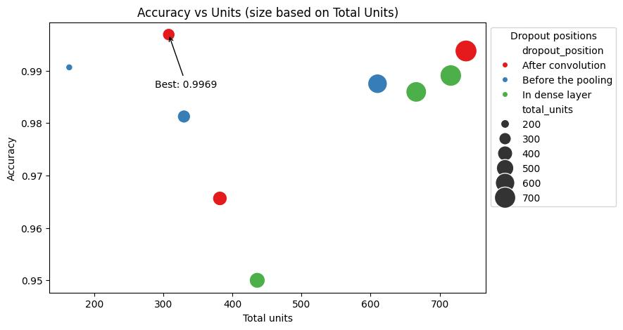

***Verslag Hypertuning  ***

***Naam: Francesca Paulin  ***

***Datum: 17-12-2024***

***Experiment: Vergelijking CNN vs LSTM***

Dataset: Gestures

**Experiment 1: Compare LSTM hidden size vs number of layers on the gesture dataset**
Model: LSTM
Architecture: Input Layer, LSTM layer (with parameters dropout, hidden size, num_layers), 1 fully connected layer
Reflection: After 50 runs the model would overfit, so I decreased the runs to 25, 15 and later 10.
The experiment shows a relationship between low hidden size and low number of layers. Test with less then 4 layers and 200 hidden units perform better. This is probably due to the lack of complex relations in the dataset. The model does not need a large memory or a deep structure to perform on this dataset.

**Results Experiment 2 - CNN dropout positions vs units on the gesture dataset**
CNN model architecture: 
- 3 convolutional layers each with 1dCon with input (batch_size, 30, 3), filters are multiplied x2 for each layer, kernel_size=2, stride=2, activation: ReLU, MaxPooling layer and Dropout (1) layer, 
- AdaptiveMaxPool1d layer (for dimensionality reduction), Flatten layer (dimension riduction), Dropout (2) layer
- Dense layer:  two fully conected layers (units1 and unit2) with in between a Dropout (3) layer
Experiment 1: I set different dropouts positions in my model: 1. after convolution, 2. befoor Max pooling and 3. In dense layer.
I ran 6 HyperOptSearch experiments with 10 iteration, in the visualization are the best results with 10 epochs.
Reflexion: Dropout in position 1 was most effective even with small amount of units and helped to reach the best accuracy.
Dropout in other positions requires more units and more time to run. Since the learning of feaures happens in the convolutional layers, this is also the most obvious place were to place dropout to improve learnig of new features by all neurons.

**Architecture LSTM**

| Layer Type            | Output Shape                    | Parameters                           | Description                                      |
|-----------------------|----------------------------------|---------------------------------------|--------------------------------------------------|
| Input Layer           | (batch_size, seq_len, input_size)| 0                                    | Input time-series with sequence length `seq_len` and feature size `input_size` |
| LSTM                  | (batch_size, seq_len, hidden_size) | `(input_size × hidden_size + hidden_size² + hidden_size) × num_layers` | LSTM with `num_layers`, `hidden_size` units, and `dropout` |
| Last Time Step Output | (batch_size, hidden_size)         | 0                                    | Extracts the output at the last time step       |
| Dense (Linear)        | (batch_size, output_size)         | `hidden_size × output_size + output_size`        | Fully connected layer for final output          |
