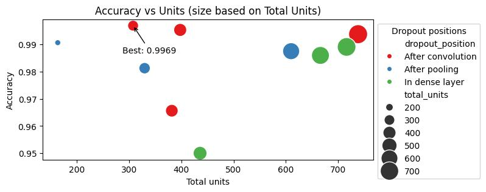

***Verslag Hypertuning - Francesca Paulin - Studentnr: 1882135                                                      Date: 17-12-2024***

Repo: [github.com/FP-byte/MADS-MachineLearning-FP](https://github.com/FP-byte/MADS-MachineLearning-FP)

**Experiment 1: Compare LSTM hidden size vs number of layers on the gesture dataset**

Architecture: Input Layer, LSTM layer (with params dropout, hidden size, num_layers), 1 fully connected layer.
Reflection: Reducing runs from 50 to 25, 15, and 10 helped avoid overfitting. The results show that fewer than 4 layers and hidden sizes > 600 perform best. Smaller hidden sizes may require longer training to avoid underfitting. Given the small and simple dataset, large memory or deeper structures are unnecessary, as high accuracy can be achieved with smaller models. Below a sample of the top 4 results:
| Model   | accuracy | iterations | hidden_size  | num_layers |
|---:|:---------|:-----------|:-------------|:-----------|
|  LSTM | 0.9859375 0.9265625 0.9140625 0.9125| 9 9 9 9 | 650 180 177 139 | 2 2 2 3 |

**Experiment 2: CNN dropout positions vs units on the gesture dataset**

CNN model architecture: 
- Three 1D Convolutional Layers: Input shape: (batch_size, 30, 3), Filters: doubled at each layer (e.g., filters, filters**2, filters **4) Kernel size: 2, Stride: 2, Activation: ReLU, Each convolutional layer is followed by a MaxPooling and a Dropout(1) layer.
- AdaptiveMaxPool1d Layer:Used for dimensionality reduction.
- Flatten Layer: Converts the output into a 2D tensor suitable for fully connected layers. Dropout(2) Layer applied after flattening.
- Two Dense Layers (Fully Connected Layers) units1 and units2. A Dropout(3) layer is applied between the two dense layers.

Reflection: Dropout in convolutional layers with filters growing bigger, achieved the best accuracy even with fewer units in the dense layer. This suggests that regularization during feature learning reduces overfitting and improves generalization without requiring more units.

